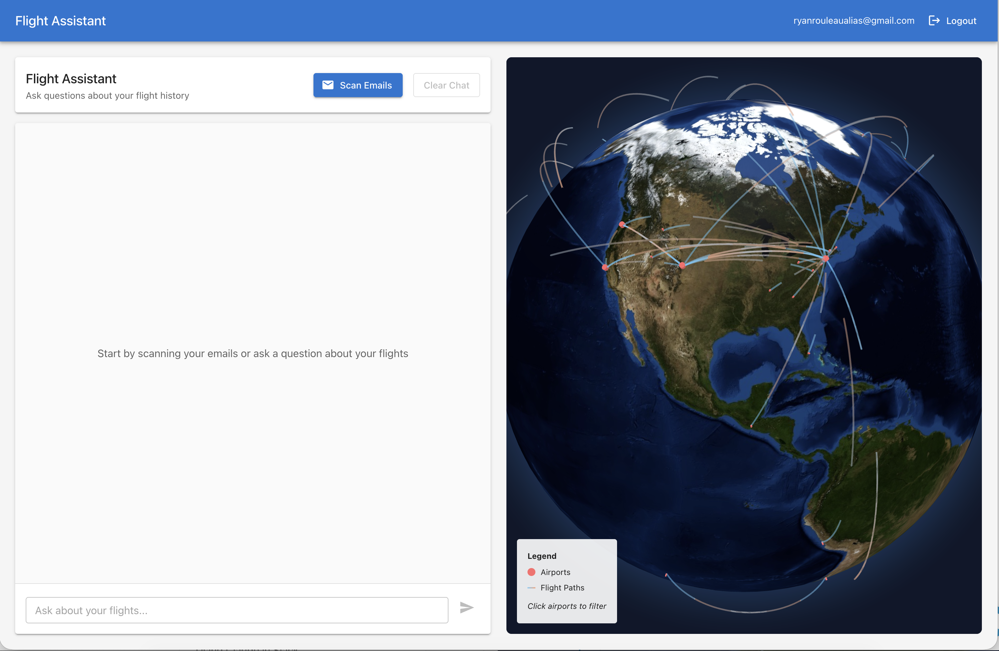
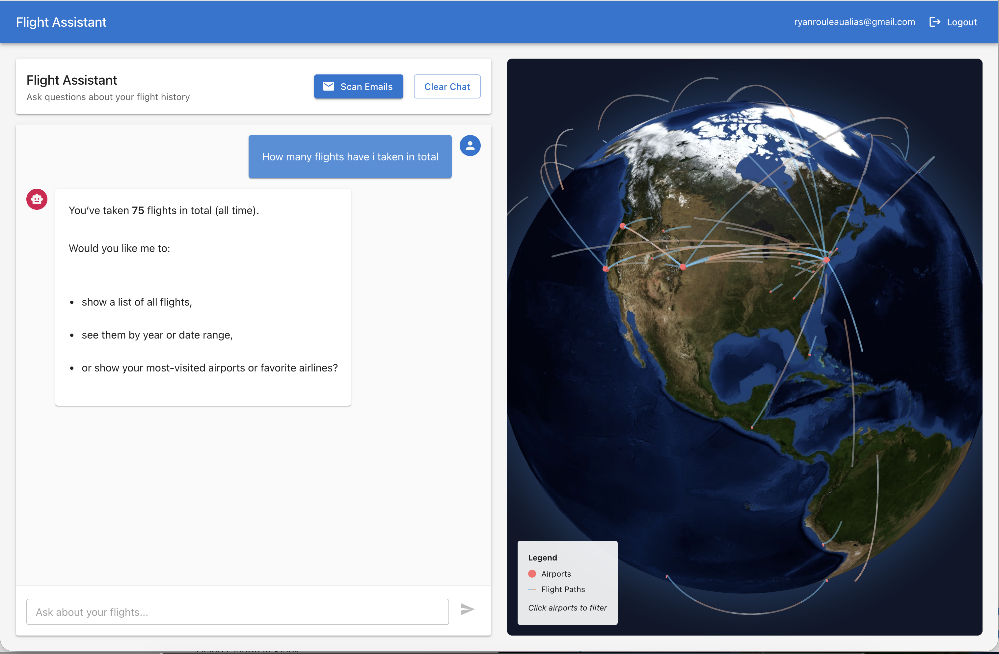
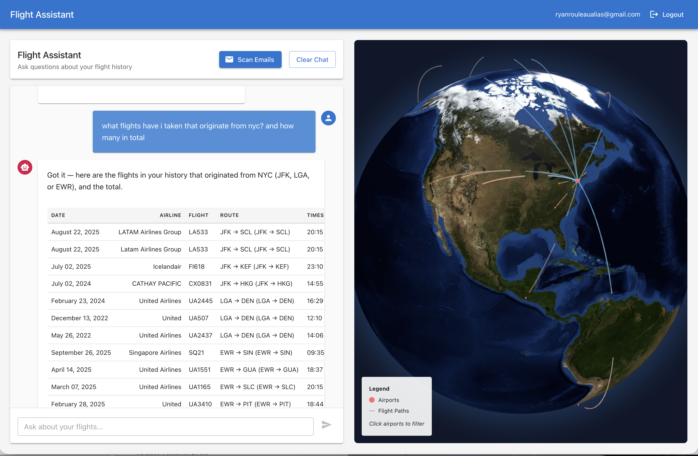
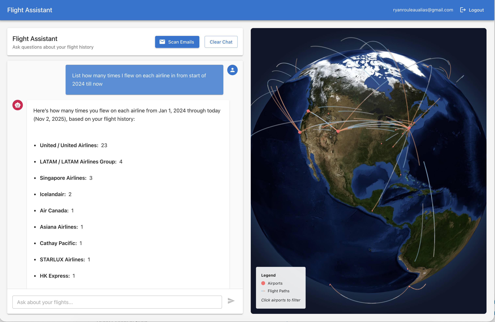
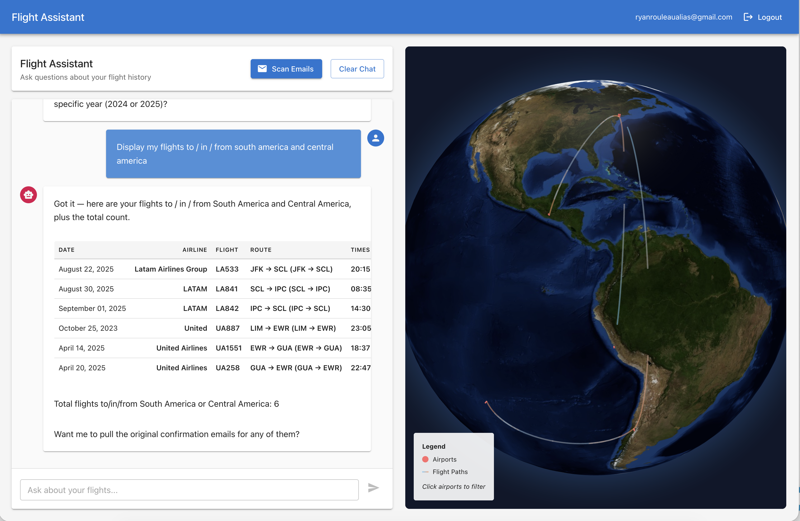

# AI Flight Stats

Login via Google, click "Scan Emails" to search for flight confirmations, AI will extract the flight data and store in a structured format, then explore your travel history through chat and an interactive 3D globe that reacts to your messages.

Ask questions like "How many flights did I take last year?" or "Show me all my United flights" and watch the globe light up with your answer.

## Examples

### Dashboard Overview

*Interactive 3D globe showing all flight paths and airports for logged in user after email scanning*

### Natural Language Chat


### Filtering by Origin

*"Show me flights from NYC" - Globe automatically highlights matching routes*

### Airline Statistics

*Get detailed statistics broken down by airline*

### Geographic Queries

*"Display my flights to/from South America" - Globe focuses on the region*

## ⚠️ Vibe Coding Alert

**This is NOT production-ready.** Built for fun and experimentation.

**Major concerns:**
- **Security vulnerabilities:** Plaintext token storage, no rate limiting, in-memory sessions, missing CSRF protection, no input sanitization
- **PII handling issues:** Stores full email content, passenger names, and confirmation numbers without encryption. No data deletion mechanism, no retention policy, not GDPR/CCPA compliant
- **Other problems:** No proper error handling, logging may leak PII, shared OAuth client causes token collisions, missing tests

Don't use this with real user data without serious security hardening.

## Tech Stack

**Backend:** Node.js, TypeScript, Express, SQLite, Gmail API, OpenAI API (GPT-5-mini)
**Frontend:** React 19, TypeScript, Vite, Material-UI, react-globe.gl

## Quick Setup

### 1. Get API credentials

**Google OAuth:**
- Go to [Google Cloud Console](https://console.cloud.google.com)
- Create project → Enable Gmail API → Create OAuth 2.0 credentials
- Add redirect URI: `http://localhost:3001/auth/google/callback`
- Save Client ID and Secret

**OpenAI:**
- Get API key from [OpenAI Platform](https://platform.openai.com)

### 2. Configure backend

```bash
cd backend
npm install
```

Create `backend/.env`:
```env
GOOGLE_CLIENT_ID=your_client_id
GOOGLE_CLIENT_SECRET=your_client_secret
GOOGLE_REDIRECT_URI=http://localhost:3001/auth/google/callback
OPENAI_API_KEY=your_openai_key
SESSION_SECRET=any_random_string
FRONTEND_URL=http://localhost:5173
```

### 3. Configure frontend

```bash
cd frontend
npm install
```

Create `frontend/.env`:
```env
VITE_API_URL=http://localhost:3001
```

### 4. Run it

**Terminal 1 (backend):**
```bash
cd backend
npm run dev
```

**Terminal 2 (frontend):**
```bash
cd frontend
npm run dev
```

Open `http://localhost:5173` → Login with Google → Scan Emails → Ask questions!

## Features

- **Email scanning:** Searches Gmail for flight confirmations
- **AI parsing:** GPT extracts flight details from messy emails using structured output
- **Smart chat:** Ask natural language questions about your flight history
- **3D globe:** Interactive visualization of airports visited and flight paths
- **Auto-highlighting:** Chat responses focus the globe on relevant flights

## Architecture

```
┌─────────────────────────────────────────────────────────────────────────┐
│                           Frontend (React)                              │
│  ┌─────────────────┐                        ┌──────────────────────┐   │
│  │  DashboardPage  │                        │    AuthContext       │   │
│  │  ┌───────────┐  │                        │  (OAuth Flow)        │   │
│  │  │ChatInterface│ │◄──────────────────────┤                      │   │
│  │  └───────────┘  │                        └──────────────────────┘   │
│  │        │         │                                 │                 │
│  │  ┌─────▼──────┐ │                                 │                 │
│  │  │FlightGlobe │ │◄────Globe Focus                 │                 │
│  │  │(3D Viz)    │ │                                 │                 │
│  │  └────────────┘ │                                 │                 │
│  └─────────────────┘                                 │                 │
└────────────┬─────────────────────────────────────────┼─────────────────┘
             │ HTTP/REST                               │
             │                                         │
┌────────────▼─────────────────────────────────────────▼─────────────────┐
│                      Backend (Express + Node.js)                       │
│  ┌──────────┐  ┌──────────┐  ┌──────────┐  ┌──────────┐              │
│  │Auth      │  │Flights   │  │Chat      │  │Health    │              │
│  │Routes    │  │Routes    │  │Routes    │  │Check     │              │
│  └─────┬────┘  └────┬─────┘  └────┬─────┘  └──────────┘              │
│        │            │              │                                   │
│  ┌─────▼──────┬─────▼──────┬──────▼─────┬──────────┬──────────┐      │
│  │Gmail       │Parser      │Chat        │Flight    │Airport   │      │
│  │Service     │Service     │Service     │Tools     │Service   │      │
│  │            │            │            │          │          │      │
│  │• OAuth     │• HTML→Text │• GPT-5     │• Query   │• IATA    │      │
│  │• Search    │• GPT-5     │• Function  │  Helpers │  Lookup  │      │
│  │• Fetch     │• Extract   │  Calling   │• Filter  │• Coords  │      │
│  └────┬───────┴─────┬──────┴──────┬─────┴────┬─────┴──────────┘      │
│       │             │             │          │                        │
│       │             └─────────────┼──────────┘                        │
│       │                           │                                   │
│  ┌────▼───────────────────────────▼────────────┐                      │
│  │         Database Service (SQLite)           │                      │
│  │  • flights table                            │                      │
│  │  • Deduplication logic                      │                      │
│  │  • Query methods                            │                      │
│  └─────────────────────────────────────────────┘                      │
└────────────┬──────────────────────┬─────────────────────────────────┬─┘
             │                      │                                 │
┌────────────▼─────┐   ┌────────────▼─────────┐   ┌─────────────────▼──┐
│  Gmail API       │   │   OpenAI API         │   │  Airport Dataset   │
│  (Email Fetch)   │   │   • GPT-5-mini       │   │  (Static JSON)     │
│                  │   │   • Parsing          │   │                    │
│                  │   │   • Chat + Tools     │   │                    │
└──────────────────┘   └──────────────────────┘   └────────────────────┘
```

## How It Works

1. **OAuth flow** gets access to your Gmail
2. **Scan emails**: Searches for flight confirmation emails via Gmail API
3. **Extract data**: GPT-5-mini parses emails with strict schemas to extract dates, airports, airlines, flight numbers, passenger names
4. **Store**: Saves flight data to SQLite with airport coordinates from static dataset
5. **Chat**: User asks natural language questions → GPT function calling → Database queries → Structured response
6. **Visualize**: Chat responses include globe focus instructions → Frontend highlights relevant flights/airports on 3D globe

## Project Structure

```
backend/src/
├── server.ts           # Express app
├── routes/             # API endpoints
├── services/           # Gmail, OpenAI, database logic
└── data/               # Airport coordinates dataset

frontend/src/
├── components/         # React components (Chat, Globe, Auth)
├── pages/              # Login, Dashboard
└── services/           # API client
```

## API Endpoints

- `GET /auth/google` - Start OAuth
- `POST /flights/scan` - Scan Gmail for flights
- `GET /flights` - Get all flights
- `POST /chat` - Chat with AI about flights

## Testing

```bash
cd backend
npm test
```

## If This Were Production...

You'd need to add: token encryption, secure sessions, rate limiting, CSRF protection, input sanitization, data deletion APIs, audit logs, consent flows, proper error handling, monitoring, backups, comprehensive tests, and probably hire a security team.

But it's not, so enjoy the vibe!

## License

MIT - Fork it, break it, learn from it. Just don't use it with real users.
